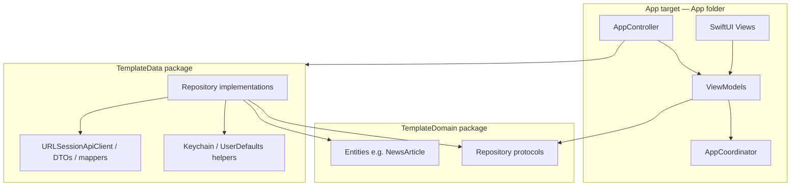
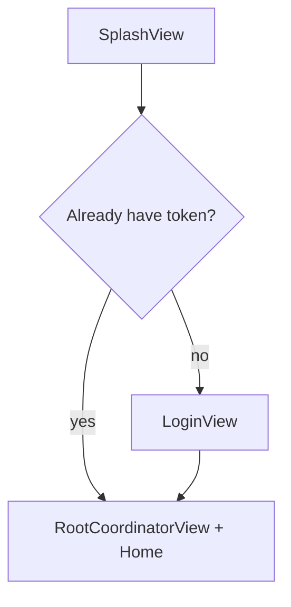
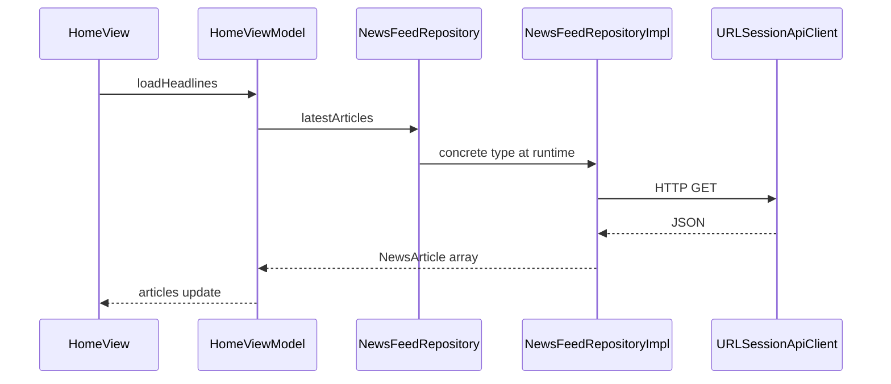

# iOS Template (Clean Architecture + SwiftUI)

A small starter project I use when I want **SwiftUI**, **local Swift packages** for domain and data, and **XcodeGen** so the `.xcodeproj` stays out of git fights. Nothing here is fancy on purpose: you get a splash screen, a demo login (Keychain + 2s delay), a real headlines list from a public API, and a coordinator-style navigation stack you can grow.

If you just cloned this: skim the diagrams below, run it once, then fork the flow when you add your own features.

---

## Requirements

- **Xcode 15+** (tested on recent iOS 17+ SDKs)
- **XcodeGen** — install once, e.g. `brew install xcodegen`
- **iOS 17+** deployment target (see `project.yml`)

---

## How to run

From the repo root:

```bash
xcodegen generate
open iOS-template.xcodeproj
```

The Xcode project is **generated** and is **not** kept in git (see `.gitignore`). After a fresh clone, run `xcodegen generate` once before opening Xcode.

In Xcode:

1. Select the **`iOS-template`** scheme.
2. Pick any **iOS Simulator**.
3. Press **Run** (Product menu, or Command-R).

**Demo login:** enter any non-empty email and password. After a short delay a token is written to the Keychain and you’ll land on the news list. **Sign out** is in the top-left of the home screen.

**First launch:** you’ll see a splash, then login (unless a token is already in Keychain from a previous run).

For a **physical device**, set your **Team** on the app target under *Signing & Capabilities*.

---

## What’s in the repo

```
iOS-template/
├── project.yml              # XcodeGen — defines the Xcode project
├── README.md                # you are here
├── ARCHITECTURE.md          # shorter internal notes (optional read)
├── App/                     # SwiftUI app — presentation + composition root
│   ├── IOSTemplateApp.swift
│   ├── AppController.swift
│   ├── Configuration/
│   ├── Base/
│   ├── Navigation/
│   └── Features/
└── Packages/
    ├── TemplateDomain/      # entities + repository *protocols* only
    └── TemplateData/      # API, DTOs, mappers, repository *implementations*
```

The **generated** `iOS-template.xcodeproj` is meant to be produced locally (or in CI) with `xcodegen generate`. You *can* commit it if your team prefers; this template assumes YAML is the source of truth.

---

## Why XcodeGen?

The project file is described in **`project.yml`** (text). That means:

- readable diffs when you add targets or packages  
- fewer merge conflicts than hand-editing `project.pbxproj`  
- the same `xcodegen generate` step in CI or on a fresh machine  

It’s optional in theory, but this repo is built around it.

---

## Architecture (big picture)

**Rule of thumb:** *Domain knows nothing. Data knows domain. The app wires everything and shows UI.*

### Layer diagram



- **TemplateDomain** — pure Swift: models and `*Repository` *protocols*. No UIKit/SwiftUI, no URLSession.
- **TemplateData** — concrete types: networking, decoding, mapping to domain models, Keychain, etc. Implements the protocols from domain.
- **App** — SwiftUI, coordinators, `AppController` (composition), and `AppConfiguration` (URLs / service IDs).

Dependency direction: **Presentation → Domain** (via protocols). **Data → Domain** (implements protocols). **Domain → nothing** in your modules.

### Runtime flow (splash → login → home)



- If Keychain already has a token, **`AppController.isAuthenticated`** starts `true`, so after the splash you go **straight to the main shell** (no login form).
- **`AppController`** owns `TemplateDataServices`, `LoginViewModel`, `HomeViewModel`, and `AppCoordinator`.

### Data flow (load headlines)



---

## Navigation (coordinator pattern)

Navigation is intentionally boring and explicit:

1. **`AppRoute`** — a `Hashable` enum (e.g. `.article(NewsArticle)`).
2. **`AppCoordinator`** — holds `NavigationPath` and helpers like `push` / `pop`.
3. **`RootCoordinatorView`** — wraps a `NavigationStack(path:)` and maps each route to a destination view.

To add a new screen you usually:

1. Add a case to **`AppRoute`** (with whatever payload you need).
2. Push from a view: `coordinator.push(.yourCase(...))`.
3. Handle the case in **`RootCoordinatorView`** inside `navigationDestination`.

That keeps navigation out of your view models as much as possible, while still feeling natural in SwiftUI.

---

## How to add a feature (practical checklist)

Say you want **“Saved articles”** (example).

### 1. Domain (`Packages/TemplateDomain`)

- Add entities if needed, e.g. `SavedArticle` or reuse `NewsArticle`.
- Add a protocol, e.g. `SavedArticlesRepository`, with the operations the UI needs.

### 2. Data (`Packages/TemplateData`)

- Add DTOs + mapper if you talk to an API, **or** use `UserDefaults` / SwiftData / files if it’s local.
- Add `SavedArticlesRepositoryImpl: SavedArticlesRepository`.
- Register it on **`TemplateDataServices`** (new property + init wiring).

### 3. App (`App/`)

- Add **`SavedViewModel`** taking `SavedArticlesRepository` in its initializer (the protocol, not the impl).
- In **`AppController`**, create the view model (same pattern as `HomeViewModel`) and expose it via `environmentObject` or pass it into a view.
- Add **`SavedView`**, route in **`AppRoute`**, push from wherever makes sense.

### 4. Configuration

- Put base URLs and non-secret IDs in **`AppConfiguration`** → **`TemplateDataConfiguration`**. Avoid scattering `URL(string: "...")!` across the app.

That’s the whole rhythm: **contract in domain → implement in data → compose in AppController → bind in SwiftUI**.

---

## Injecting another ViewModel

- **Screens that live a long time** (tabs, main feeds): add a `let` on **`AppController`**, initialize next to `homeViewModel`, inject with **`environmentObject`** or pass into the root view.
- **Pushed one-off screens**: often create the ViewModel in **`navigationDestination`** (you can pass `services` or a factory from `AppController` if you want).

There’s more detail in **`ARCHITECTURE.md`** if you want a shorter reference doc inside the repo.

---

## Configuration & secrets

- **News API:** Spaceflight News — public read-only endpoint; base URL is in **`AppConfiguration`**.
- **Auth:** demo only — **`AuthRepositoryImpl`** sleeps ~2s and stores a fake token in Keychain. Swap the implementation when you have a real backend; keep **`AuthRepository`** in domain stable.
- **Logging:** **`SafeLog`** uses `os.Logger` with conservative privacy (paths/status public-ish, error text private). Watch **Console** while debugging network.

Do **not** commit API keys into the repo; use xcconfig, environment, or your team’s secret store.

---

## Troubleshooting

| Issue | Idea |
|--------|------|
| No `.xcodeproj` | Run `xcodegen generate` from repo root. |
| Package graph errors | File → Packages → Reset Package Caches (Xcode), then build again. |
| Simulator signing noise | Simulator builds usually need no team; device builds need a Team. |
| Stuck “logged in” | Delete app from simulator or clear Keychain by reinstalling; or use **Sign out**. |

---

